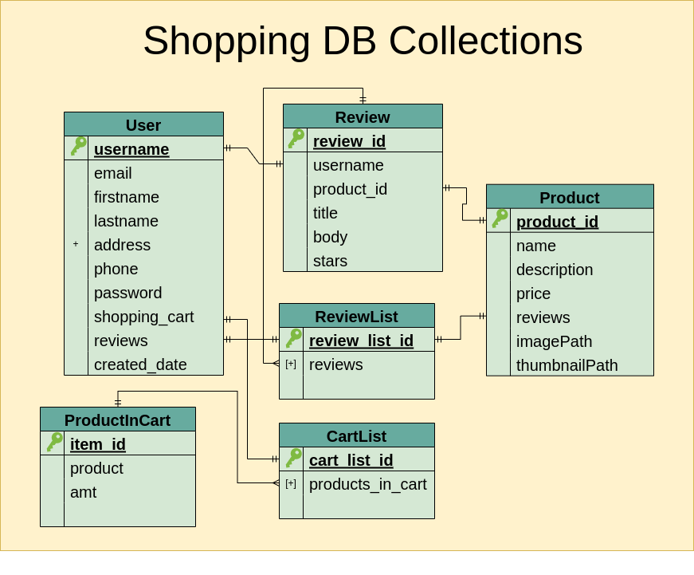

# Shopping Interface Design Decisions

This shopping interface will be designed for US users only.  This will limit the possibilities we need to validate in the schema for address and phone number, as
well as reduce the frontend design needs.

# Shopping DB Collections

## Schemas

The core of the schema describes the documents User, Product, and Review.  The ProductInCart schema is used in a subdocument array in the shopping cart:




```
ProductInCart{ 
	product_id: {
		type: Number
	}
	amt: {
		type: Number		
	}						
}

User
{
	email: {
		type: String,
		required: [true, 'email field is required'],
		unique: true,
		pattern: ^([a-zA-Z0-9_\-\.]+)@((\[[0-9]{1,3}\.[0-9]{1,3}\.[0-9]{1,3}\.)|(([a-zA-Z0-9\-]+\.)+))([a-zA-Z]{2,4}|[0-9]{1,3})(\]?)$
	}
	username: {
		type: String,
		required: [true, 'username is required'],
		unique: true,
		minLength: 5,
		maxLength: 35,
	}
	firstname: {
		type: String,
		required: [true, 'firstname field is required'],
		minLength: 2,
		maxLength: 40
	}
	lastname: {
		type: String,
		required: [true, 'lastname field is required'],
		minLength: 2,
		maxLength: 40
	}
	address: {
		properties: {
			company: {
				type: String,
				maxLength: 100
			}
			street_address {
				type: String,
				minLength: 5,
				maxLength: 150
			}
			apt_number {
				type: String
			}
			city {
				type: String,
				maxLength: 50
			}
			state: {
				type: String
			}
		}
	}
	phone: {
		type: String,
		pattern: ^\d{3}-\d{3}-\d{4}$
	}
	password: {
		type: String,
		required: [true, 'password field is required']
	}
	shopping_cart: {
		type: [ProductInCart]		
	}
	createdDate: {
        type: Date,
        default: Date.now,
    },
	review_ids: {
		type: [Number],
	}
	createdDate: {
		type: Date,
		default: Date.now
	}
}


Product
{
	product_id: {
		type: Number,
		required: [true, 'product_id field is required'],
		unique: true,
	}
	name: {
		type: String,
		required: [true, 'name field is required'],
	}
	description: {
		type: String,
		required: [true, 'description field is required'],
	}
	price: {
		type: Decimal128,
		required: [true, 'price field is required'],
	}
	tax: {
		type: Decimal128,
		required: [true, 'price field is required'],
	}
	review_ids: { 
		type: [Number]
	}
	imagePath: {
		type: String,
		required: [true, 'image field is required']
	}
	thumbnailPath: {
		type: String,
		required: [true, 'image field is required']
	}
}

Review
{
	review_id: {
		type: Number,
		required: [true, 'email field is required'],
		unique: true,
	}
	username {
		type: String,
		required: [true, 'username is required'],
		unique: true,
		minLength: 5,
		maxLength: 35,
	}
	product_id {
		type: Number,
		required: [true, 'product_id field is required'],
		unique: true,
	}
	title: {
		type: String,
		required: [true, 'title field is required'],
	}
	body: {
		type: String,
		required: [true, 'body field is required'],
	}
	stars: {
		type: String,
		required: [true, 'stars field is required'],
		pattern: ^/[1-5]/
	}
}

```

### Justification for Data Validation

Data validation takes time and thus should be justified in any NoSQL Database.  There are a number of reasons to validate fields in an application like a shopping interface that will require storing large amounts of data.  We
wish to prevent data from being accidentally entered with missing fields that will prevent it from being found or displayed correctly.  We want to prevent accidental data entry of obviously invalid data (eg. forgetting an '@'
symbol in an email).  From this standpoint, the necessity of data integrity for a commercial application far outweighs the convenience and speed of keeping all fields unspecified. For this reason, this shopping example will
use a schema designed to validate all necessary fields.  

### Balancing Avoiding Unnecessary Duplication of Data with Speed

The justification of using a NoSQL Database is its ability for its more flexible features to increase speed of data input and retrieval over SQL Databases.  However, unnecessary data duplication can negatively impact speed 
by increasing document size, which increases the time taken to retrieve the corresponding document.  It can also increase the possibility of introducing errors.  To this end, this schema balances these two needs by using a 
list of review_ids nested inside each User and Product document. The id list speeds the retrieval of the data while preventing unnecessary data in the Review Collection, such as the body of the review, from being duplicated 
in the User and Product collections.

### ID Retrieval Patterns

Since we will be retrieving the reviews only after looking at a customer or product id, we technically do not need to store those in the review itself.  However, when retrireving a Review document, we will need to retrieve 
both the review information and the information of the other document type.  For example, if we retrieve a review for a customer, we will also need to retrieve its corresponding product, and if we retrieve a review for a product, 
we will also need to retrieve information about its corresponding customer.  To resolve this without needing the review items themselves to have the extra ids, we could store the corresponding review\_id's and product\_id's together 
in the User document, and the corresponding review\_id's and usernames in the Product document.  However, since doing this could nearly double the size of Users and Product documents with many associated reviews with little to 
no increase in retrieval speed, I do not believe this to be a good design choice.  Therefore I have instead placed both the associated product_id and username in the Review schema itself to avoid the space costs of the 
alternative design choice.

### User Schema Notes

The phone number should be a string so that we can specifiy a reqex.  We will store it with the dashes, unlike how we would if an SQL database were being used, as this saves a few formatting operations at retrieval time 
at the expense of increasing space requirements, which is keeping in the philosophy of using a NoSQL database. The frontend should automatically insert the dashes for the user in the interface and when submitting to the 
backend so they don't have to enter them.

The image path stores the path to the image on the server, which will be added to the img tags in the html coded in the React frontend.

**security considerations**\
The username is a field added entirely for display convenience and security reasons for the end-user.  Some reasons users may want a username:
* provides a unique identifier of each user to anyone reading reviews, to allow them to uniquely identify users over multiple reviews to judge their individual credibility.
This also prevents confusion by a user from seeing a review from someone with the same first and last name as them.  If a user wants their full name to be visible, they may 
incorporate it into their username.
* protects the user's privacy by not requiring the listing of sensitive information like their email or potentially sensitive information like their full name (to encourage 
people to review products even if they don't want their real name associated with the review for whatever reason, such as not wanting others to be able to track their 
purchasing habits)

The following information is considered sensitive for the user and we should avoid exposing it publicly:
* password
* email
* firstname
* lastname
* address
* phone

The most sensitive information here is the password, as obtaining it allows a malicious party to acces their account and impersonate the user, as well as obtain sensitive information regarding the user.
However, the other information is still sensitive and should not be displayed publicly.  We should do tests to check whether malicious attacks can expose any of this information.

The shopping cart inside the User uses an array of the subdocument declared earlier called ProductInCart.  Product in cart has a product_id corresponding to the name of a product, and an amt corresponding to the
number of items bought of that type. 

### Data Type References

https://docs.mongodb.com/realm/mongodb/document-schemas/ 

https://www.mongodb.com/developer/quickstart/bson-data-types-decimal128/

https://mongoosejs.com/docs/schematypes.html#arrays

### Matching Using Regex

RegEx is short for regular expression.  Regular expressions are available in many languages to match on a pattern, and have consistent rules across those languages regarding their use.
I have used the pattern specifier should be used to specify the schema as shown in the documentation, but I have also seen regex and match used:

**with pattern specifier:**\
https://docs.mongodb.com/manual/reference/operator/query/jsonSchema/

https://docs.mongodb.com/realm/mongodb/enforce-a-document-schema/

**with regex specifier:**\
https://docs.mongodb.com/manual/core/schema-validation/

**with match specifier:**\
https://stackoverflow.com/questions/66383516/add-mongoose-validation-for-phone-numbers

The email regex pattern used comes from:\
https://regexlib.com/Search.aspx?k=email&AspxAutoDetectCookieSupport=1

# Backend JS Design

The backend needs to send the information obtained from the react frontend to the database.  The Mongoose library is used to communicate with the database, while the Express library is used by the backend for the HTTP protocol commands such as GET, POST, and DELETE in order to communicate between the backend server and the frontend client.  The Express library is used to listen for and respond to these commands on the server. 

## Express API

The server listens for HTTP commands such as POST, GET, and DELETE to specific routes.  These commands are received with request data sent by the client Once these commands are received, it can perform a database action, log error messages, and populate a resource to be returned to the client.

```
api/auth/signup POST: adds a new User to the database

api/auth/login GET: retrieves one User from the database

api/product GET: retrieves one Product to be displayed by axios  display on a
product page.  This includes the Review item list  associated with that
Product.  Then must retrieve each Review document from Database by querying
all the ids in the list (TODO: look into refactoring DB design to use a
subdocument list instead of ID list as is done with the shopping cart so this
doesn't have to be done.  This would mean that slightly more time is required
when adding a review as it needs to be added as a subdocument to both User and
Product, but less time when retrieving one to be viewed.  However, this would
also mean that when just getting product information without getting reviews
you have to get all of review data. The solution may be to keep the current
User and Product schema with just the IDs and make copies of them that have
the Review subdocument.  then the Product or User collection with just the id
list has another field like UserWithFullReviews or ProductWithFullReviews that
is a copy of User or Product respectively but with a subdocument list instead
of id list. Then if you don't need the Reviews you can query the User or
Product without them, but if you do need them, you can Query the User or
Product with them.  This also means we can drop the id lists entirely as they
will never be used). 

api/landingProducts GET: retrieves the list of 3 items from the  Product collection to display on the landing page based on number of five star reviews

api/similarProducts GET: retrieves a list of 3 items from the Product collection based on a category field
 

```


## Files
The server/routes folder will contain the files for the Express HTTP protocol commands.  These files should be imported into server/server.js with a require.  The setup of the database tables helps to guide the file organization.

```
in server/routes:

user.js - includes user as well as shopping cart collection GET and POST commands (since shopping cart is part of user)
review.js - includes  review GET, POST, and DELETE commands
product.js - includes product GET command


```


## Security

### Password Hashing 

Password hashing should be performed on the server side to prevent the server from storing plaintext passwords.  This way, if the passwords file on the server is stolen, it cannot be used to authenticate since the hash cannot be entered on the client side to authenticate.  The server side will hash it again and compare it to the hash, which will fail.  This is a standard security system that is very robust.  The security of this system depends on: attacker not being able to change server software, https, and a secure hash algorithm using an off-the-shelf security library.  

The server requirement is why this is done on the server side and not the client side.  The client side is very easy for an attacker to change the code for since it is run on their own computer, but the attacker typically does not have the ability to change the code executing on the server computer systems. 

### Displaying Password

Displaying the password in a url is acceptable in the early stages of development for testing purposes, but this should not be removed once the signin implementation is completed. 

# Frontend Design

The frontend will use the React library to render the webpages.  It will use the Axios library to send HTTP requests such as GET, POST, and DELETE to the corresponding routes and commands set up on the backend.

## Mockups

The following page mockups were designed on Moqups.com:

### The Landing Page


### The Product Page


### The Cart Page


The frontend needs to perform the following functions at minimum:
* allow a user to sign up
* allow a user to sign in
* allow a user to see a product description
* allow a user to write a review of a product
* allow a user to add a product to the shopping cart

The frontend needs the following pages:
* landing page
* product page
* shopping cart page
* sign up page
* sign up success page
* login page

## Code Design

The frontend will be designed using React, a popular Node.js library for frontends.

There are many possible approaches in code design in Node.js, as it uses the JavaScript language.  We can stick to a more procedural approach or make it look a little more object oriented.  Either way, the important thing is that the design be consistent throughout. 


# Testing

Testing should use easily produced datasets (small or acquired from a public dataset).  This is in case testing uncovers a need to change the Database schema.  If the database schema is changed, it may invalidate the test set
and require the production of another test set. 

**Automated Testing**\
Automated tests will make testing code faster in the long run, so automated tests will be designed for both the frontend and backend.  For the frontend (client) side, the [React Testing Library](https://testing-library.com/docs/react-testing-library/intro/) 
and [Selenium](https://www.selenium.dev/) will be used.  The React Testing library is added with the default install of a React application.   Selenium is not added by default but must be installed via npm,
and any browser drivers for browsers to be tested must be added as well.  To install selenium and the browser drivers for chrome and firefox, use the following command:

```
npm install --save selenium-webdriver chromedriver geckodriver
```
The frontend will be tested by the automated tests by reading the contents of the page, entering in test data into text boxes, pressing buttons, and reading the page output to make sure it gives the 
expected information.

For backend tests, the [Mocha](https://github.com/mochajs/mocha) test framework will be used.

**React Testing Library Automated Tests**\
1. Check for page logo on landing page
2. Click the Sign In/Track Order link and check for correct page title
3. Click the Favorites link and check for the correct page title
4. Click the cart link and check for correct page title

**Selenium Automated Tests**\
1. Try to login with an invalid username and password - check for 'that username/password combination does not exist'
2. Try to login with an invalid email (with @ symbol) and password - check for 'that username/password combination does not exist'
3. Try to sign up with invalid email (no @ symbol) - check for @ error message
4. Try to sign up with valid email-check for confirmation
5. Try to login with a valid username and password - check for the user page title
6. At the sign-up page, sign a user up with valid info.  Check details of user page to make sure that all details match with details entered in at signup.

**Manual Testing**\
Manual testing will be used in the initial phases before automated tests are set up, and to supplement the automated tests for situations that are difficult to test in an automated way.  Testing the backend manually 
can be done with [Postman](https://www.postman.com/) or [Insomnia](https://insomnia.rest/).  The tests will check not only that the test returns the expected pass or fail state, but that it returns a useful and unique message. This is intended to help make the frontend easier to debug and to use the messages from the database when appropriate to give the user useful feedback on what the error is, and to make database errors easier to debug.  

Messages should also be tested for security concerns to check that they do not leak sensitive information, either from users or about the website or company as a whole.

**Insomnia or Postman Tests**
1. Create a valid user with all valid required information
2. Create a valid user including all valid optional information
3. Create an invalid user missing a username
4. Create an invalid missing an email
5. Create an invalid user missing a first name
6. Create an invalid user missing a last name
7. Create an invalid user missing a password
8. Create a user with various invalid emails that use incorrect format
9. Create a user with an invalid username less than 5 characters
10. Create a user with an invalid username greater than 35 characters
11. Create a user with an invalid first name less than 2 characters
12. Create a user with an invalid first name greater than 40 characters
13. Create a user with an invalid last name less than 2 characters
14. Create a user with an invalid first name greater than 40 characters
15. Create a user with an invalid company name greater than 100 characters
16. Create a user with an invalid street address of less than 5 characters
17. Create a user with an invalid street address of greater than 150 characters
18. Create a user with an invalid city name of greater than 50 characters
19. Create a user with an invalid phone number 
